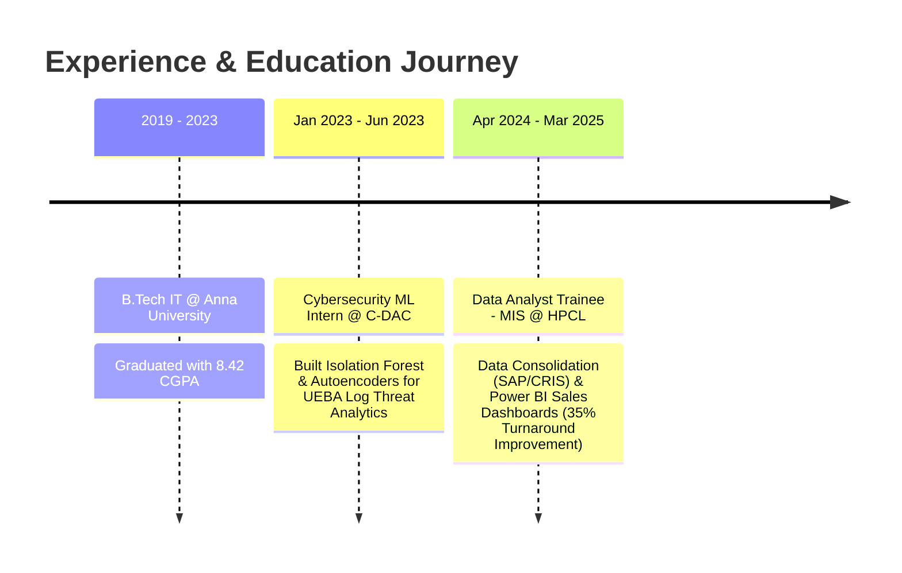

  <!-- Animated Vector SVG Header Banner -->
  

    

  <!-- Interactive Typing Animation (URL-Encoded for GitHub Proxy Compatibility) -->
  

    

  <!-- Social & Quick Action Badges -->
  
  &nbsp;
  
  &nbsp;
  
  &nbsp;
  

 

---

### ⚡ Key Metrics & Quantified Impact

<table align="center" width="100%">
  <tr>
    <td width="25%" align="center">
      <h2>🚀 35%</h2>
      
<b>Faster BI Reporting</b> <small>Engineered SQL & Power BI dashboards @ HPCL</small>

    </td>
    <td width="25%" align="center">
      <h2>🛡️ 25%</h2>
      
<b>Higher Detection Accuracy</b> <small>UEBA Anomaly Detection via Autoencoders @ C-DAC</small>

    </td>
    <td width="25%" align="center">
      <h2>📉 40%</h2>
      
<b>False Positive Cut</b> <small>End-to-end ML log analysis pipeline @ C-DAC</small>

    </td>
    <td width="25%" align="center">
      <h2>🎯 91%</h2>
      
<b>R² Model Precision</b> <small>Vehicle Performance Forecasting model</small>

    </td>
  </tr>
</table>

---

### 👤 Professional Profile & Core Competencies

> **Data Analyst who turns multi-source enterprise data into decisions leadership can act on.**

- 📈 **Business Intelligence & Analytics:** Specialist in consolidating complex data streams (**SAP ERP, CRIS, TIBCO Spotfire, SQL**) into interactive **Power BI** dashboards and automated reporting systems.
- 🤖 **Machine Learning & Deep Learning:** Experienced in anomaly detection, predictive modeling, and feature engineering using **Python (Scikit-Learn, TensorFlow, Pandas, NumPy)**.
- 🏛️ **Proven Enterprise Impact:**
  - **MIS Data Analyst Trainee @ HPCL** (Hindustan Petroleum Corporation Limited, Govt. of India)
  - **Cybersecurity ML Intern @ C-DAC** (Centre for Development of Advanced Computing, Govt. of India)
- 🎓 **Academic Excellence:** B.Tech in Information Technology from Anna University (**CGPA: 8.42 / 10**).
- 📜 **Certified Professional:** Google Data Analytics Professional Certificate | NATS Graduate Apprenticeship Certificate.

---

### 🛠️ Interactive Tech Stack & Capabilities

| Category | Skills & Tools |
| :--- | :--- |
| **Languages** |     |
| **Data Analytics & BI** |     |
| **Data Science & ML** |     |
| **Databases & Cloud** |     |
| **Tools & Version Control** |    |

---

### 💼 Professional Work Timeline

📍 <b>Data Analyst Trainee – MIS (NATS Graduate Apprenticeship)</b> | <i>HPCL (Govt. of India)</i> [Apr 2024 – Mar 2025]

 

- **Enterprise Data Consolidation:** Streamlined transactional data across **SAP, CRIS, and Spotfire** for accurate executive reporting.
- **Sales Analytics:** Analyzed sales figures for core petroleum products (**MSHSD, Turbojet, E20, Lubricants**) and tracked outstanding customer dues.
- **Dryout & Market Share Analysis:** Evaluated sales vs. Dryout metrics via **SQL and Excel**, enabling pinpoint market-share tracking.
- **BI & Dashboarding:** Designed interactive **Power BI dashboards** with customized SQL views, cutting turnaround times and elevating data accessibility by **35%**.
- **Statistical Benchmarking:** Formulated target-vs-actual models for daily/weekly performance tracking.

📍 <b>Cybersecurity Intern – Machine Learning / Deep Learning</b> | <i>C-DAC (Govt. of India)</i> [Jan 2023 – Jun 2023]

 

- **User Behavior Analytics (UEBA):** Developed threat detection models using **Isolation Forest** & **Autoencoders** to flag lateral movement and geographic log anomalies.
- **Full ML Pipelines:** Managed complete pipeline lifecycle—log ingestion, feature extraction, model inference, and real-time indexing via **Python, NoSQL, and Elasticsearch**.
- **Metrics Achieved:** Boosted detection accuracy by **25%** and decreased false positive alerts by **40%**.

---

### 🚀 High-Impact Projects

<table width="100%">
  <tr>
    <td width="50%" valign="top">
      

        <h3>🚘 Vehicle Performance Analyzer</h3>
        

          
          
        

      

      <ul>
        <li>Trained a <b>Random Forest Regression</b> model to predict vehicle performance metrics based on engine telemetry inputs.</li>
        <li>Deployed as an interactive <b>Flask web application</b>.</li>
        <li>Attained an <b>R² accuracy score of 91%</b>.</li>
      </ul>
      

        <a href="https://github.com/Rohit-Jha-D"><b>Explore Code Repository »</b></a>
      

    </td>
    <td width="50%" valign="top">
      

        <h3>💳 Credit Card Fraud Detection</h3>
        

          
          
        

      

      <ul>
        <li>Built an automated fraud classifier utilizing optimized <b>Support Vector Machines (SVM)</b>.</li>
        <li>Handled severe class imbalance using SMOTE & feature engineering.</li>
        <li>Achieved a <b>0.92 F1-score</b> on financial transaction records.</li>
      </ul>
      

        <a href="https://github.com/Rohit-Jha-D"><b>Explore Code Repository »</b></a>
      

    </td>
  </tr>
  <tr>
    <td width="50%" valign="top">
      

        <h3>🛡️ UEBA Anomaly Detection Engine</h3>
        

          
          
        

      

      <ul>
        <li>Built a network log analyzer for User & Entity Behavior Analytics (UEBA).</li>
        <li>Utilized <b>Isolation Forest</b> and <b>Deep Autoencoders</b> for spatial & lateral threat detection.</li>
        <li>Reduced SOC false positive alert noise by <b>40%</b>.</li>
      </ul>
      

        <a href="https://github.com/Rohit-Jha-D"><b>Explore Code Repository »</b></a>
      

    </td>
    <td width="50%" valign="top">
      

        <h3>🌐 VANETs Authenticated Key Protocol</h3>
        

          
          
        

      

      <ul>
        <li>Implemented a fast secure routing and key agreement protocol for vehicular ad-hoc networks (VANETs).</li>
        <li>Programmed robust cryptosystems in Java with a MySQL database layer.</li>
      </ul>
      

        <a href="https://github.com/Rohit-Jha-D"><b>Explore Code Repository »</b></a>
      

    </td>
  </tr>
</table>

---

### 📊 GitHub Activity & Real-Time Stats

  <table border="0">
    <tr>
      <td>
        
      </td>
      <td>
        
      </td>
    </tr>
  </table>

   

  

---

### 📬 Get In Touch

  
<b>Looking for a Data Analyst, BI Developer, or ML Professional? Let's connect!</b>

  
  
  &nbsp;
  
  &nbsp;
  

    
  

